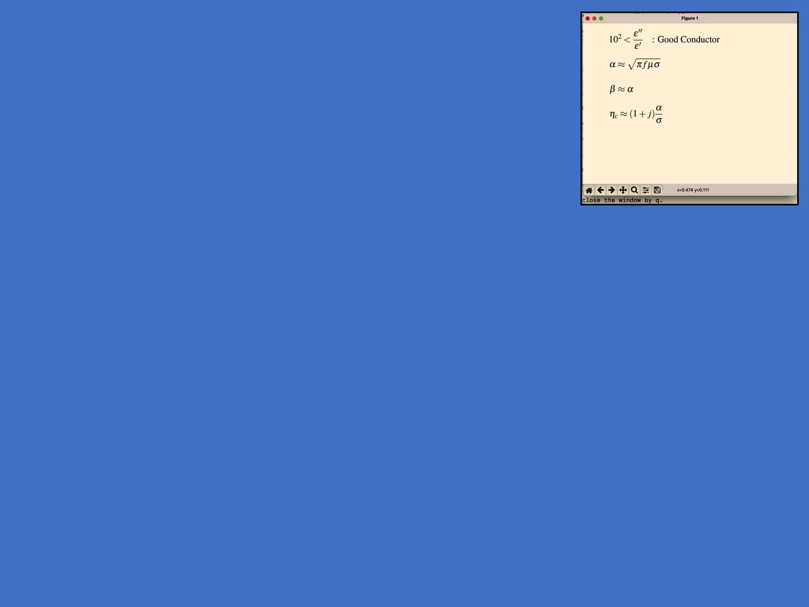
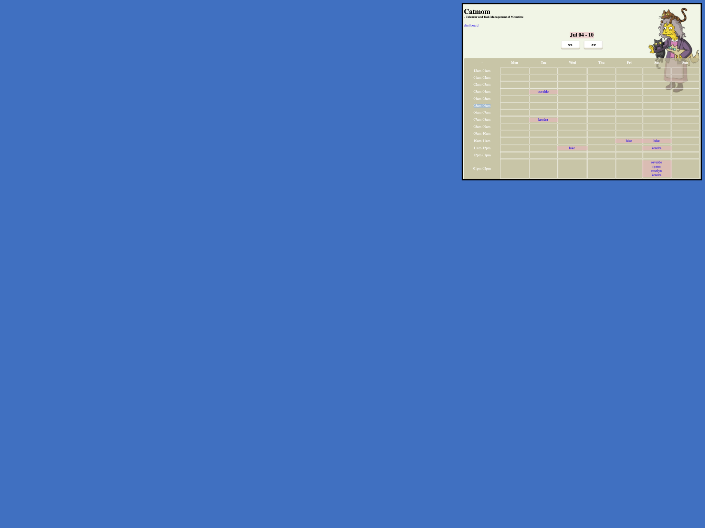

## Formulaby

browse physics formulas
- frequent formulas into database
- later: algorithm, render
- how to combine
```bash
$ formulaby good_conductor
```


---
## Lukearchive

Personal Archive
- First Django
- googling(a lot) AWS, Server
- [desktop](https://drive.google.com/file/d/1OldXELOV2WntBaCSYtdVnpFteZBpku4Y/view?usp=sharing), [mobile](https://drive.google.com/file/d/1AXAFVg161sXuFlsJSUs4uuo9jzBjZReC/view?usp=sharing)

---
## Bruin Calender
Event Calendar App
- Hey guys! imple/consult
- Disagree, Vote for Everything opposite
- Learn to respect
- [Demo](https://drive.google.com/file/d/1Tk87AdSXnsgLTDFfFaYskOtzxnDOPWrj/view?usp=sharing)

---
## Catmom
Employee Time Management App
- Interview? deploy/give me code, Bye!
- Heroku in a week

---
## Epoch2greg
Timezone Conversion Utility
- standard and life of engineers
